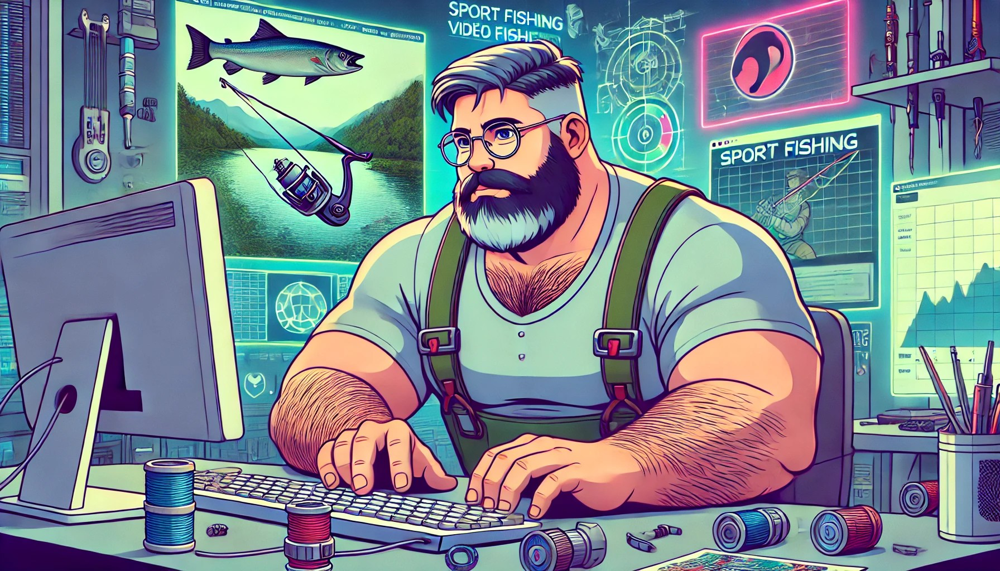

## Sobre mim

- 🎓 Pós-Graduando em Inteligência Artificial e Machine Learning - Unicid
- 🎓 Formação em Ciência de Dados - Unicid
- 🎓 Formação Administração com habilitação em Análise de Sistemas
- 🎓 Formação Técnica em Processamento de Dados
- 💻 Apaixonado por tecnologias inovadoras
- 🚀 "A qualidade mais valiosa para o aprendizado é uma atitude positiva." - Bobbi DePorter

## Hobbies e Interesses Pessoais

- 📚 Ficção Científica, Biografias, Fantasia
- 🎮 Retrô games, consoles, emuladores
- 🎣 Pesca esportiva! Minha terapia, minha paz!
- 🏞️ Ecoturismo, camping, viajar

## Contato        
              

README EM CONSTRUÇÃO!! 
